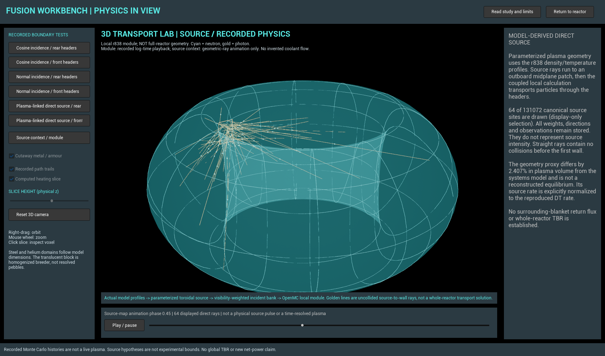

# Fusion Workbench

[**Progress graph, timeline and goals**](https://chriszavadil.github.io/fusion-workbench-open/progress/) separates design findings, unresolved tests, reused work and website changes. Goals have explicit pass/stop rules and dependencies, not a promise of when fusion will work.

**New here?** [Start with the plain-language visual guide](https://chriszavadil.github.io/fusion-workbench-open/) or [watch our recorded particle calculation](https://chriszavadil.github.io/fusion-workbench-open/#watch). We have not produced fusion or generated electricity. This project tests design ideas in software; numerical power estimates are not hardware results.

**Browser verification repaired:** actual installed-Edge checks now cover the homepage, Power progress, EC-wave and plant-decision pages, including power-history CSV export, reference-ray animation and the narrow-screen power layout. [Dated verification and repeatable procedure](docs/BROWSER_VERIFICATION_2026-09-16.md). Security policies remain enabled; this is application verification, not new fusion evidence.

**Power progress:** [best recorded model, historical results and real-world experiments](https://chriszavadil.github.io/fusion-workbench-open/power-progress/). The headline is conditional modeled net electricity, not physical output. Failed and retired claims stay visible; JET, TFTR and NIF measurements are separately labeled and sourced.

**September16 research update:** [Equilibrium and EC-wave explorer](https://chriszavadil.github.io/fusion-workbench-open/ec-wave/) shows four force-balanced construction cases, the restored56-point analytical study and a separately labeled canonical ITER reference ray. The construction does not match the original scalar-q assumptions; candidate current drive remains unqualified. Read the dated research report and preserved failures before using the values. The released Unreal binary is unchanged.

**Whole-plant design study:** a controlled, fixed-radius PROCESS comparison gives a conditional +100 MW burn-phase net output and +59.3 MW pulse/availability-adjusted average when more of the same heating power is credited with driving current. This is not achieved power: the required current-drive/deposition/control capability is unvalidated. [Inspect the recorded comparison and actuator rejection target](https://chriszavadil.github.io/fusion-workbench-open/plant-decision/) and read the full study in the research library. The released Unreal executable and accepted reactor configurations are unchanged.

**Open research for humanity.** Explore conceptual fusion devices, inspect the evidence, reproduce calculations and help improve the models. This is a research preview—not a working fusion reactor or proof of generated net electricity.

[**Open the browser workbench**](https://chriszavadil.github.io/fusion-workbench-open/) · [**Download the Windows Unreal preview**](https://github.com/chriszavadil/fusion-workbench-open/releases/tag/v0.5.1-public) · [**Contribute**](https://github.com/chriszavadil/fusion-workbench-open/issues/new/choose) · [**Research update feed**](https://chriszavadil.github.io/fusion-workbench-open/feed.xml)

## What is available
The browser workbench contains two separate reactor concepts, component inspection and cutaways, recorded electrical profiles, six source/header transport cases, particle playback, selectable heating slices, 90 readable research records, source hashes, dated updates and an explicit what-works/what-is-unresolved dashboard. It is a static GitHub Pages application: your browser renders the visuals, and the research computer does not need to stay on.

The packaged Unreal Windows application additionally provides a source-to-wall overview and an optional, explicitly configured local PROCESS worker. The public website does not run Unreal, execute scientific solvers, contact the research workstation or automatically run contributor code. A published snapshot or a passing software test is not experimental reactor validation.

## Latest research result and limits
A candidate-linked direct neutron source was constructed from reproduced plasma profiles and a declared toroidal geometry proxy. In the local header comparison, front headers produced approximately 2.71% less tritium per entering neutron than rear headers. The sign is resolved within the conditional Monte Carlo calculation; the result is not a whole-reactor breeding ratio, reusable-fuel result, optimized hardware or extra electricity.

The geometry proxy differs by 2.407% in plasma volume from the systems model. Surrounding-material return flux, compatible experimental breeding benchmarks, full-geometry material/source closure, thermal/structural qualification and fuel recovery remain unresolved. The application preserves these limitations and earlier failed or superseded findings.

## Try it and contribute
Use the browser link for installation-free viewing. For the Windows app, extract the entire archive and run `FusionWorkbench.exe`; Unreal Editor and Python are not required for recorded viewing. The unsigned native preview was exercised on the research workstation, not certified on every PC. Keep normal operating-system protections enabled and verify the release checksums.

Read [CONTRIBUTING.md](CONTRIBUTING.md), choose an [open task](https://github.com/chriszavadil/fusion-workbench-open/issues), and identify the configuration, closest prior research, proposed change, evidence rights and a test that could reject the idea. Submit issues or pull requests for review. Downloading a proposal brief does not submit it, and no outside submission automatically replaces an accepted configuration.

## Reproducibility and updates
Install the dependencies in `requirements-tests.txt`, then run `python -m pytest -q tests`. Rebuild the static site with `python tools/build_pages.py`. After a reviewed research update, rebuild the research library and site, run the checks, and commit the generated files; GitHub Pages publishes the selected branch's `docs/` directory. See [PAGES_PUBLICATION.md](PAGES_PUBLICATION.md).

Historical numerical reports retain their original dates, scopes and hashes. The public-release version is **0.5.1-public**; the unchanged native executable is **0.5.0-preview**, and scientific evidence in this snapshot is through **2026-09-13**. This publishing release changes accessibility, not fusion-performance claims.

## Optional local solver
Review `tools/setup_solver.py`, then use `Setup_Solver.cmd` and `Start_Local_Worker.cmd` with Git and Python 3.10 installed. The approved input and runtime-module hashes are checked. The worker listens only on loopback; never expose it publicly or run unreviewed contributor code on the development computer.

## Source layout
`native/` contains our Unreal C++/Slate app and generated assets. `app/` and `tools/` contain the browser app, reviewed worker and export scripts. `research/approved_inputs/`, `research/runtime/` and `research/source/experiments/` preserve the inputs, disclosed adaptations and experiment code. `research/reports/` and the Research library provide the cleared narrative record. `docs/` is the static website and also contains historical application documentation.

The canonical source export preserves 131,072 sampled sites, identities, positions, directions, weights and probabilities, plus the supporting profiles and observations. The visual drawing budget is separate from these stored records. Not every historical raw dataset or tracked particle history exists in the public package; per-experiment reproduction instructions state the limits.

## Licensing and privacy
Our original application code and generated visualization assets are MIT-licensed. Unreal Engine and scientific dependencies retain their own licenses; the compiled application is not wholly MIT software. See [THIRD_PARTY_NOTICES.md](THIRD_PARTY_NOTICES.md) and [ENGINE_RUNTIME_NOTICE.md](ENGINE_RUNTIME_NOTICE.md).

This repository begins from the reviewed source snapshot and does not import private Git history, credentials, personal correspondence, private execution configuration or debugging logs. Required third-party attribution is preserved. No analytics or central live-compute service is added. Report security concerns through [SECURITY.md](SECURITY.md), not by publishing secrets in an issue.
